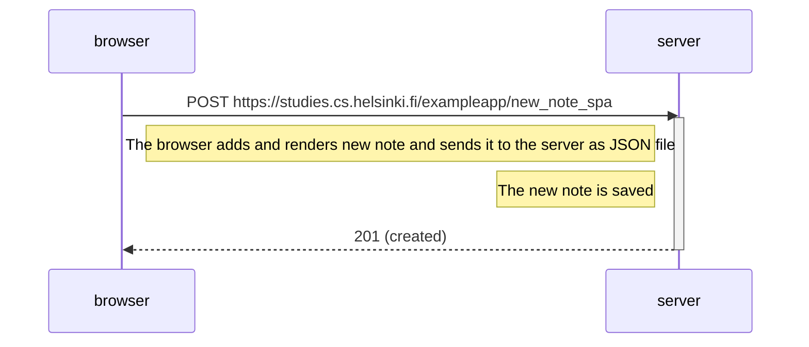

# Uusi muistiinpano

```mermaid
sequenceDiagram
	participant browser
	participant server
    
	browser->>server: POST https://studies.cs.helsinki.fi/exampleapp/new_note_spa
	activate server
  Note right of browser: The browser adds and renders new note and sends it to the server as JSON file
  Note left of server: The new note is saved
	server-->>browser: 201 (created)
	deactivate server
```
